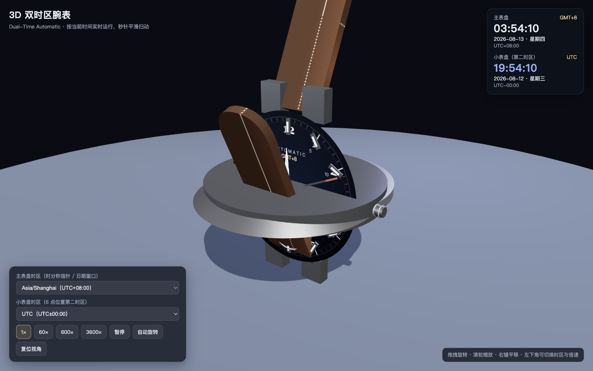

# 3D 双时区腕表（Dual-Time Watch）

一个可直接运行的 3D 腕表动画：按系统当前时间实时走时，秒针、分针、时针连续平滑转动，
表盘带有日期窗口与星期窗口，并在 6 点位置设有第二时区小表盘，可同时追踪两个时区。



## 文件结构

```
.
├── index.html            # 入口页（含 UI 与样式）
├── js/
│   ├── core.js           # 纯逻辑层：时区换算、指针角度、日期/星期、缓动（无 DOM 依赖）
│   └── app.js            # 渲染层：Three.js 场景、材质、动画循环、交互、内置自检
├── vendor/
│   ├── three.min.js      # Three.js r128（本地化，离线可用）
│   └── OrbitControls.js  # 轨道相机控制（本地化）
├── tests/
│   └── core.test.js      # Node 自动化单元测试（node:test，零依赖）
└── README.md
```

## 运行方式

**方式一：直接双击打开（推荐，离线可用）**

依赖已全部本地化，无需联网、无需安装、无需构建。用任意现代浏览器
（Chrome / Edge / Safari / Firefox，需支持 WebGL）双击打开 `index.html` 即可。

**方式二：本地静态服务器**

```bash
cd <本项目目录>
python3 -m http.server 8000
# 浏览器打开 http://localhost:8000
```

## 操作说明

- **视角**：鼠标拖拽旋转、滚轮缩放、右键拖动平移；右下角「复位视角」恢复默认机位。
- **主表盘**：显示主时区（默认取系统时区）的时/分/秒，秒针无跳秒、连续扫动；
  3 点位为日期窗口，9 点位为星期窗口。
- **小表盘**：6 点位显示第二时区（默认 UTC）的时/分指针与日/夜指示点。
- **数字面板**：右上角实时显示两个时区的数字时间、日期、星期与 UTC 偏移，便于核对。
- **时区切换**：左下角两个下拉框可任选 IANA 时区；切换时指针沿最短路径平滑过渡，不瞬跳。
- **倍速与暂停**：支持 1× / 60× / 600× / 3600× 加速（用于观察分针、时针与跨天翻转）以及暂停。
- **自动旋转**：表身缓慢环绕展示。

可选 URL 参数（`index.html?tz1=Asia/Shanghai&tz2=America/New_York&speed=60`）：

| 参数 | 说明 | 默认值 |
| --- | --- | --- |
| `tz1` | 主表盘时区（IANA 名称） | 系统时区 |
| `tz2` | 小表盘时区 | UTC（系统为 UTC 时取 Asia/Shanghai） |
| `speed` | 初始倍速 | 1 |
| `test` | 任意值触发浏览器内置自检 | — |

## 测试说明

### 1. 逻辑单元测试（Node ≥ 18，无需安装任何依赖）

```bash
cd <本项目目录>
node --test tests/core.test.js
```

覆盖内容：指针角度公式与已知时刻核对、秒针跨分钟边界的连续性、24 小时回卷、
时区偏移（含纽约/伦敦夏令时与冬令时）、跨天日期与星期换算、中英文标签、
最短角差、缓动曲线、倍速/暂停锚点、时区列表回退逻辑。

### 2. 浏览器内置自检

打开 `index.html?test`（或在地址栏补 `?test`），页面中央会弹出自检面板，逐项显示：

- WebGL 上下文与画布挂载；
- 渲染循环帧数；
- 秒针 600ms 平滑转动约 3.6°；
- 分针/时针角度与理论目标一致；
- 日期窗口、星期窗口与当天一致；
- 第二时区切换后走针平滑过渡、最终指向正确时间；
- 60× 倍速下模拟时间的实际推进倍率。

全部通过时面板边框变绿并显示「自检结果：N/N 全部通过」；结果同时以 JSON 输出到
浏览器控制台（`[watch-selftest]`），并暴露为 `window.__watchSelfTest` 供自动化脚本读取。

### 3. 人工验收清单

1. 打开页面，右上角数字时钟与本机时间一致（秒级），秒针连续扫动、无跳秒。
2. 把第二时区设为 `Asia/Shanghai`、主时区设为 `UTC`：小表盘应比主表盘快 8 小时。
3. 设 60× 倍速：秒针明显加快，分针约每秒走 1 格（6°）；3600× 倍速下观察日期/星期在午夜翻转。
4. 切换任一主时区，观察三根指针沿最短路径平滑过渡，而非瞬间跳变。
5. 旋转视角到背面，可看到表冠、表耳、表带与表底盖细节；日期窗口始终朝向表盘正面。

## 实现要点

- 时间与渲染解耦：`js/core.js` 为纯函数（UMD），Node 与浏览器共用同一份代码，保证可测试性。
- 指针角度由墙钟时间直接推导：`秒 = (秒数 + 毫秒/1000) × 6°`，分针、时针叠加秒/分分量，
  因此三针均为连续运动；时区切换时用「最短角差 + 三次缓入缓出」实现约 0.9s 的平滑过渡。
- 时区换算基于 `Intl.DateTimeFormat`（`formatToParts` + `fractionalSecondDigits`），
  自动处理夏令时；偏移量用 +400 年技巧规避 `Date.UTC` 对 0–99 年份的特殊解释。
- 表盘、日期窗、星期窗、小表盘、表底盖与表带均为程序生成的 Canvas 纹理，无外部图片资源。

## 已知限制

- 依赖浏览器/运行时的 IANA 时区数据库（现代浏览器与 Node 均内置）；极旧环境会回退到
  `js/core.js` 内的常见时区列表。
- 年份 0–99 的墙钟换算采用 +400 年平移处理，展示不受影响；公历公元前日期不在支持范围。
- `file://` 协议下一切正常（经典脚本 + 本地文件，无跨域请求）；若通过服务器访问同样兼容。
